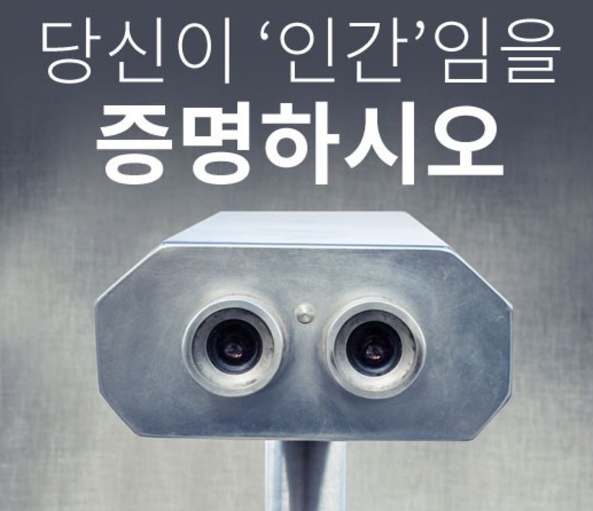
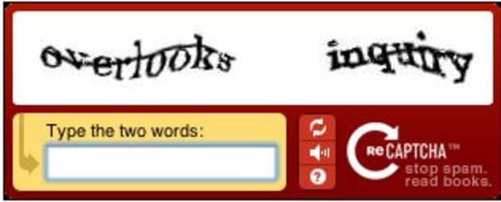
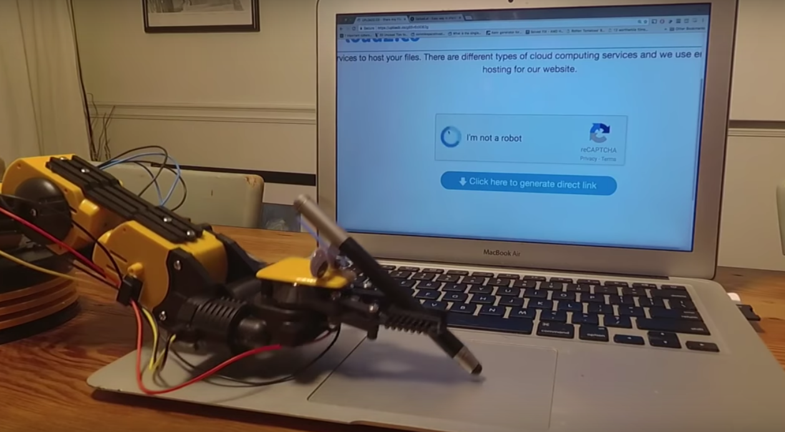
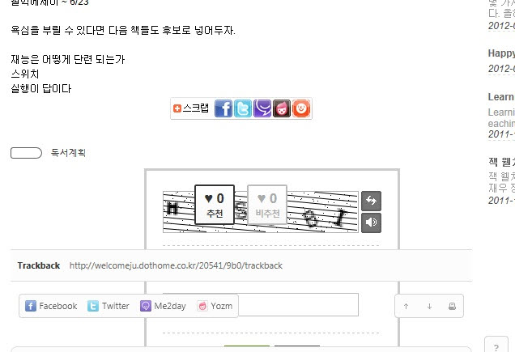
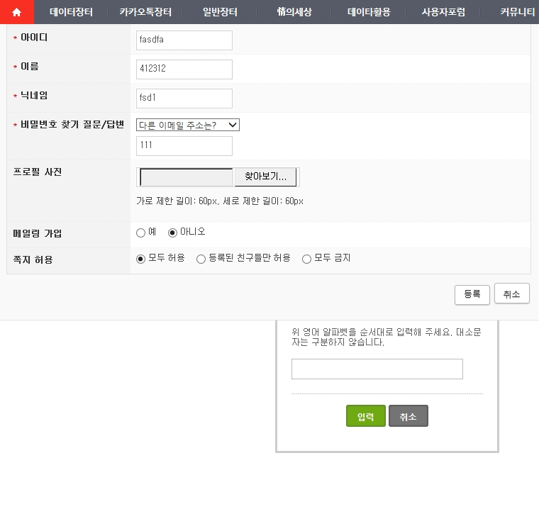
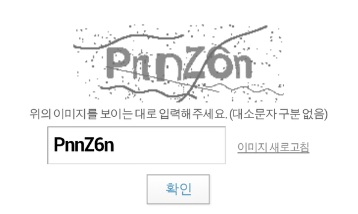
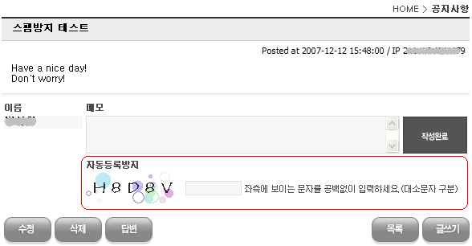
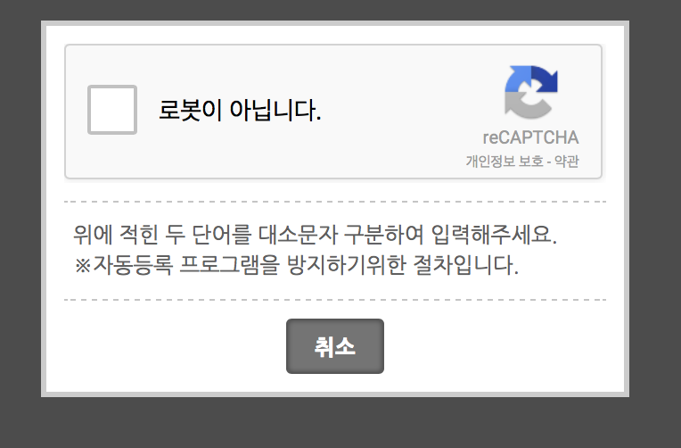

## 캡챠(CAPTCHA)

### 1. 서비스

"당신이 __인간__임을 증명하시오."

인간과 로봇의 대결은 영화 속에서만 일어나는 것은 아닙니다. 자동화 프로그래밍된 로봇이 온라인 투표에 참여하여 불법을 저지르거나, 악성 스팸 메시지를 남기는 일이 발생하자 이를 분간할 방법이 요구되었습니다. 그렇게 탄생한 인간을 식별할 수 있는 보안 서비스가 캡챠(CAPTCHA)입니다.

#### 1.1 CAPTCHA(Completely Automated Public Turing test to tell Computers and Humans Apart)

루이스 폰 안, 마누엘 블룸, 니콜라스 호퍼와 카네기 멜론 대학의 존 랭 포드에 의해 2000년 개발된 캡챠는 일반적으로 웹 서비스에 가입할 때 마주할 수 있습니다. 인간은 의도적으로 왜곡시킨 글자를 읽을 수 있지만, 로봇은 이를 수행할 수 없는데서 착안되었습니다.

<!--  -->

#### 1.2 reCAPTCHA

하지만 오늘날 로봇의 인공지능 기술은 99.8%의 정확도로 왜곡된 글자 조차 인식할 수 있도록 향상되었습니다. 즉, 더 이상 왜곡된 글자만으로 인간과 로봇을 구분할 수 없게 되었습니다. 로봇의 왜곡된 글자 인식율이 높아지자, 이에 대한 대안책을 강구하게 되었습니다.

이에  카네기 멜론 대학교의 메인 피츠버그 캠퍼스의 Luis von Ahn, Ben Maurer, Colin McMillen, David Abraham, Manuel Blum에 의해 개발된 캡챠(글자를 입력하는 대신 이미지를 활용하는 기술)을 2009년 Google이 판권을 사게 되면서 reCAPTCHA가 서비스 되고 있습니다.

예를 들어 제시된 9장의 이미지에서 고양이를 선택하도록 유도하였을 때, 고양이 옷을 입고 있는 강아지 사진이 포함되어 있을 때 사람은 이를 분간할 수 있지만, 로봇의 인공 지능은 이를 고양이로 인식한다는 것입니다.

-

### 2. 서비스 실태

[고용노동부환급과정] 캡챠

![[고용노동부환급과정] 캡챠적용 질의응답](assets/capcha-report-10.png)

[한국사회복지협의회 사이버교육원] 캡챠

![[한국사회복지협의회] 캡챠적용 질의응답](assets/capcha-report-11.png)

-

### 3. 접근성 이슈

#### 3.1 가려진 캡챠 이미지

Captcha(캡챠)가 뜨기는 뜨는데 첨부 파일과 같이 게시판 뒤로 숨어버려서 무슨 글자인지도 보이지 않고, 입력도 되지가 않네요.

https://www.xpressengine.com/qna/20647233

http://simpleeye.ivyro.net/xe/gdesign_sub_qna/78007

#### 3.2 이미지만 제공되는 캡챠 이미지

http://info.keymong.co.kr/?p=674

#### 3.3 혼동을 주는 메시지가 포함된 캡챠 이미지

https://www.xetown.com/qna/396982

#### 3.4 리캡챠의 경우

오디오 해석이 어렵습니다. 이것은 시각 장애뿐만 아니라 난독증 및 기타 인지 장애를 가진 사용자에게 장애물이 됩니다. 뿐만 아니라 캡챠 이미지를 완료하는 데 오랜 시간이 걸리며 사용성이 낮습니다. 모든 사용자가 시각적으로 사용되는 영어 단어와 오디오를 인식하는 것은 아닙니다. 그리고 키보드로 접근할 수 없는 경우도 있습니다.

-

### 4. 해외 사례

-

### 5. 해결방안 및 개선방향

-

### 6. 참고자료

- [reCAPTCHA, Google](https://www.google.com/recaptcha/intro/invisible.html)
- [reCAPTCHA, Wikipedia](https://ko.wikipedia.org/wiki/ReCAPTCHA)
- [10초 리캡챠](http://tv.naver.com/v/214835)
- [Google CAPCHA를 Robot이 통과하는 영상](https://www.youtube.com/watch?v=dwg7o7LE1QY)
- [Captcha Alternatives and thoughts, W3C](https://www.w3.org/WAI/GL/wiki/Captcha_Alternatives_and_thoughts)
- [WCAG CAPTCHA, captcha.com](https://captcha.com/accessibility/wcag-captcha.html)
- [당신이 인간임을 증명하시오, 이데일리 카드뉴스](http://m.post.naver.com/viewer/postView.nhn?volumeNo=3763064&memberNo=3939441&vType=VERTICAL)
- [캡차의 개념과 안전성 분석 사례](http://academic.naver.com/view.nhn?doc_id=78336120&ndsCategoryId=10512)
- [복수의 이미지를 합성하여 사용하는 이미지 기반의 캡차와 이를 위한 안전한 운용 방법](http://academic.naver.com/view.nhn?doc_id=13981254&ndsCategoryId=10513)
- [캡챠(CAPTCHA), 보안과 스팸 방지기능을 넘어서다](http://info.keymong.co.kr/?p=674)

<!-- 포켓몬 GO 캡챠 이미지 -->
<!-- http://kinimage.naver.net/20170130_238/14857814539899VGfL_PNG/1485781453848.png -->

<!-- Google 캡챠 이미지 검색 -->
<!-- https://www.google.co.kr/search?q=captcha&newwindow=1&source=lnms&tbm=isch&sa=X&ved=0ahUKEwjr-I6r5MjSAhXCbbwKHSKyAqQQ_AUIBigB&biw=1440&bih=799 -->
