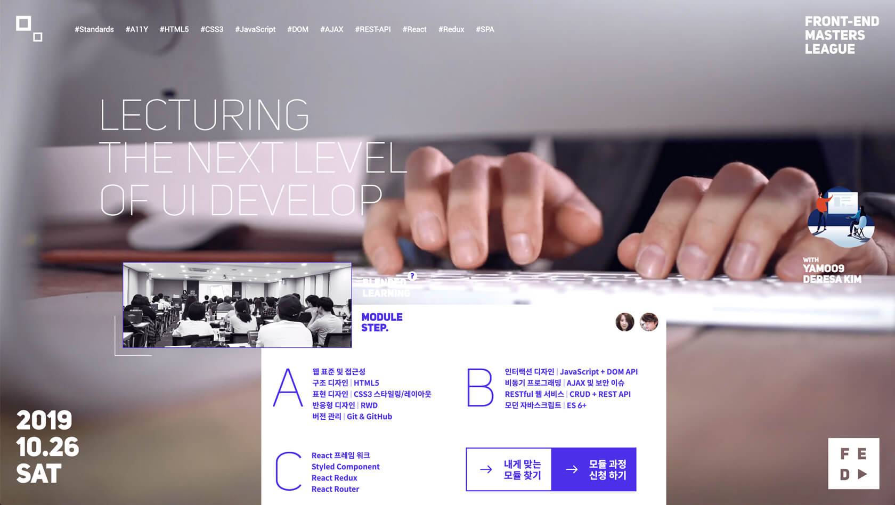

# 마스터스 리그

Front-End 개발자를 꿈꾸는 이들을 위한 블렌디드 러닝으로 개발에 필요한 모든 것! → [GO! 모집 페이지](https://yamoo9.github.io)

# 마스터스 리그 강사진

모듈 | 강사
-- | --
A | 김데레사 (Deresa Kim)
B,C | 야무 (yamoo9)

# 마스터스 리그 강의

## Module A

- 웹 표준 및 접근성 
- 구조 디자인 | HTML5
- 표현 디자인 | CSS3 스타일링/레이아웃
- 반응형 디자인 | RWD
- 버전 관리 | Git & GitHub

## Module B

- 인터랙션 디자인 | JavaScript + DOM API
- 비동기 프로그래밍 | AJAX 및 보안 이슈
- RESTful 웹 서비스 | CRUD + REST API
- 모던 자바스크립트 | ES 6+

## Module C

- React 프레임워크
- Styled Component
- React Redux
- React Router
